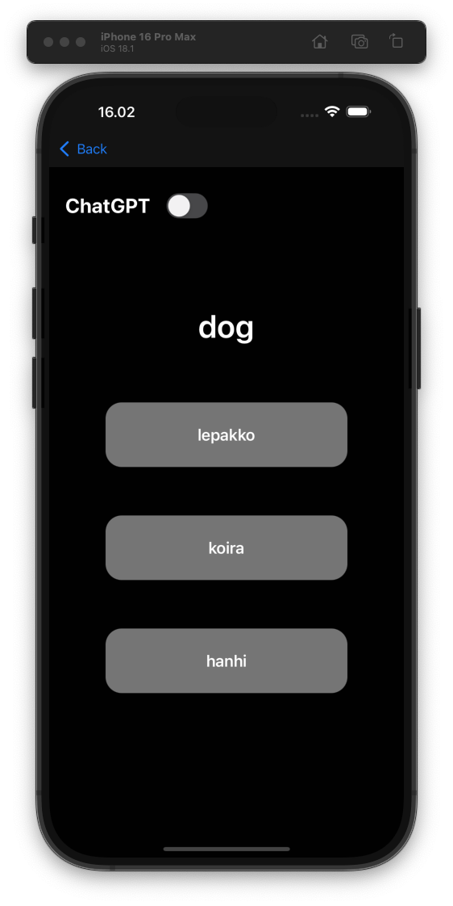
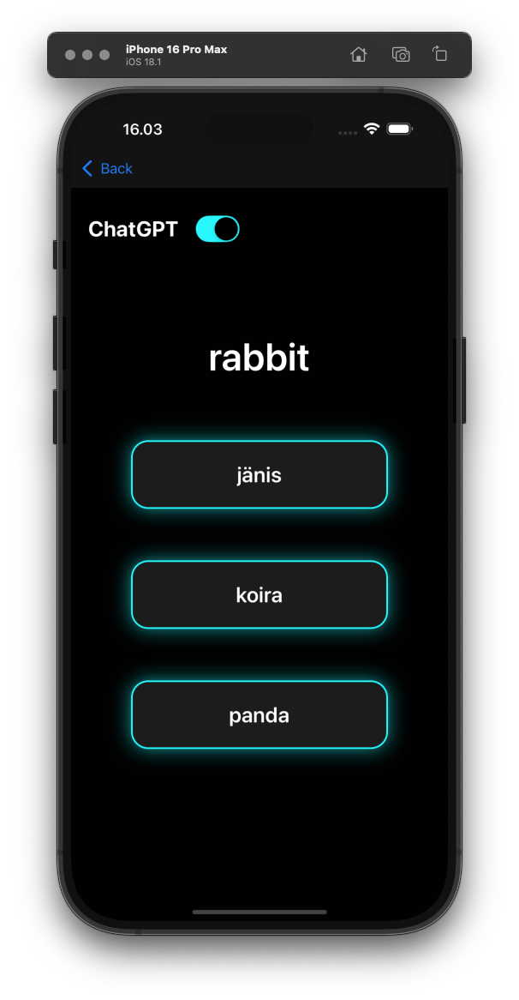

## Get started

1. Install dependencies

   ```bash
   npm install
   ```

2. Start the app

   ```bash
    npx expo start
   ```


3. Optional: You need an OpenAI API key to use the GPT version of the game.


This app is built using: 
* SQLite database
* OpenAI API
* Expo Router
* Expo DocumentPicker
* Expo FileSystem
* SF Symbols

This app is designed for iOS, so it might not work as expected on Android.

The app includes a "joke" in its styling: the normal game looks dull, but when ChatGPT is enabled, it appears more modern—even though the gaming experience is actually worse with the GPT version.


